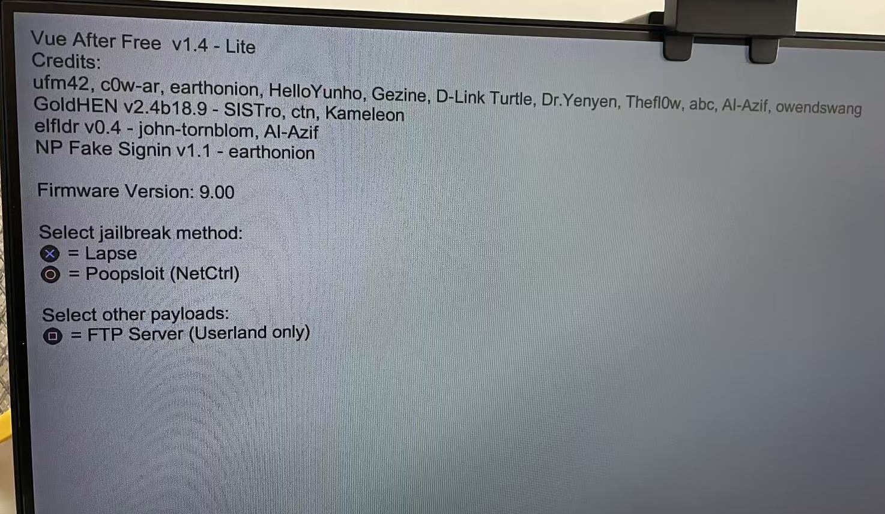
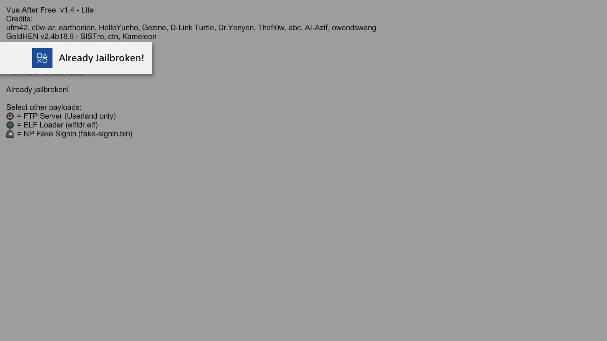
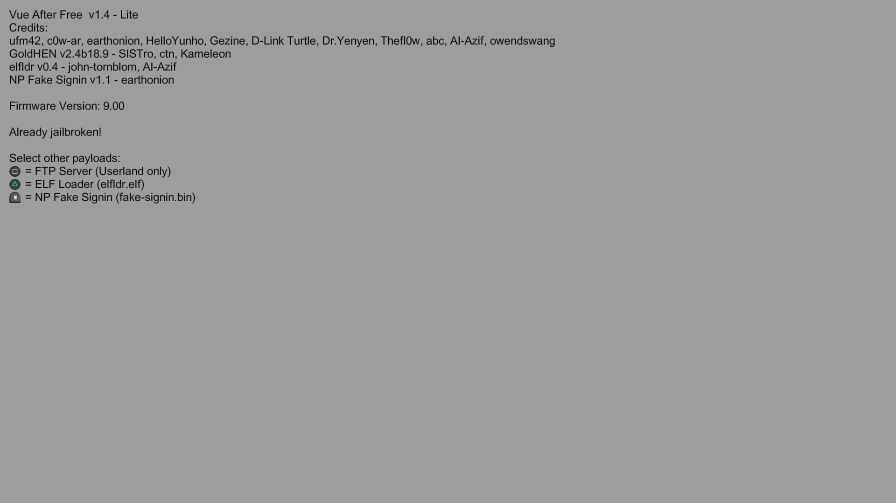
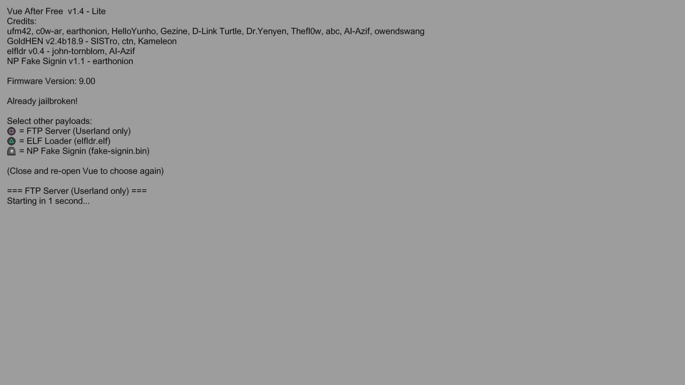

    

<h1 align="center"> Vue-After-Free-Lite </h1>

    A PlayStation Vue userland code execution exploit for Playstation 4.

# Fork Info
Everything about this repo is base on [vue-after-free](https://github.com/Vuemony/vue-after-free). Please go there for more explanation about this exploit.

What I did:
  1. Removed UI. And replaced it with only console like screen.
  2. Removed some payloads. Only elfldr, fake-signin, ftp-server left.
  3. Added GoldHEN in `download0.dat` cache.
  4. Auto start exploit after Vue opened.
  4. Auto close after any payload has been loaded.
  5. Tweaked some scopes of JS functions and variables.
  6. No changes of the exploit processes.

# Screenshots
    

# Vue After Free Userland
CVE-2018-4441 was shortly applied but due to instability and bad success rate it was dropped.    
CVE-2017-7117 is used for the userland, and has been chained with Lapse and Poopsploit(Netctrl) kernel exploits on respective firmwares marked below.

## Vulnerability Scope
KEX= Kernel Exploit
| vue-after-free (Userland) | Lapse (KEX) | Netctrl (KEX) |
| :------------------------ | :---------- | :--------------- |
| 5.05–13.04                | 1.01–12.02  | 1.01-13.00       |

## PS4 Firmware Versions Supported by this Repository

This table indicates firmware versions for which the _current version_ of this repository provides a functional tested jailbreak for.   

| 7.00-13.00 |
| :--------- |

* By default Lapse is used from 7.00 to 12.02, and Poopsploit from 12.50-13.00. Although you can choose to run Poopsploit on as low as 9.00.
* Userland exploit works 5.05 to 13.02 as is.

# FAQ

**Q: Will this work on 13.02 or above?**
Only the userland, you cannot jailbreak above 13.00 with the files in this repo.

**Q: Do I need an internet connection?**
You need any form of a network connection, not specifically internet. You can use your mobile phone hotspot or anyting else available. Vue will not launch the exploit without a network connection and will display "There was a problem connecting to the internet". Please see [Connection Instructions](#connecting-to-the-internet).

**Q: I am getting "There is a network communication issue" error.**
This indicates that either Vue has updated or your save file has reset. Use your own profile backup's save, or if using the system backup from this repo, unpack the `encryptedsavebackup.zip` to a USB and import it with the PS4 saved data management.

**Q: I am getting "This service requires you to sign in to PlayStation Network" even after replacing the save file, how can I fix it?**
Your Vue app most likely updated. This usually happens when not using a DNS or blocking Sony servers. You will have to delete and reinstall it.

**Q: I ran Vue and the app crashed?**
If the app crashes the exploit failed, shutdown the console and try again.

**Q: I ran Vue and my console shutdown, what do I do?**
If a kernel panic occurred you may need to press the power button on your console twice, then retry running the exploit.

**Q: How can I run a payload?**
Closing and reopening Vue is required between running JS payloads, but .bin or .elf payloads can be run one after the other. Select the payload from the UI in the Payload Menu.

**Q: Can I run the jailbreak offline?**
No. PS Vue requires any form of network connection. Internet is not required, so you can use any network like home WiFi, a hotspot from your mobile phone, a network from a microcontroller like ESP32, or an Ethernet network from a repurposed PPPwn device.

**Q: My payload is not recognized, what should I do?**
Format your USB drive to MBR partition and exFAT format.

> [!IMPORTANT]
> The Vue save file may occasionally reset. To avoid issues please copy the encrypted save to a USB, from the PS4 settings menu for the user that is used to run the jailbreak, for easy future recovery.   

> [!IMPORTANT]
> DO NOT change your np environment via Debug Settings, it will cause you to be unable to use a backup save file. And makes it incompatible with the current fake sign in payload. 

## Requirements
### For Vue-After-Free Users
  * FTP client
  or
  * USB flash drive.

### For Jailbroken PS4
  * Fake or legit activated PS4 user account.
  * FTP access to the console.
  * USB flash drive.

  * PlayStation Vue 1.01 base and 1.24 patch.(Referred to as "PS Vue or Vue" later in the guide). [Download](https://www.mediafire.com/file/45owcabezln2ykm/CUSA00960.zip/file)   

### For Non-Jailbroken PS4
  * USB flash drive.
  * System backup file.
> [!WARNING]
> Restoring the system backup will erase all data on your console, then apply the Vue app and it's exploit data to it.   

# Setup Instructions
## For Vue-After-Free Users
  * Replace `/user/download/CUSA00960/download0.dat` via FTP after PS4 jailbroken. You could find the `download0.dat` file in `download0-lite.zip` from [relase page](/release)
  or
  * Replace all the files in `/mnt/sandbox/download/CUSA00960/download0/` via `ftp-server.js` in the Vue app. You don't even need to jailbreak your PS4 with this method. You could find all the dist files in `download0-dist-lite.zip` from [relase page](/release)

## Jailbroken PS4
A network connection of any kind is required, before trying to run Vue please connect to a local network even if it does not have internet. [Connection Instructions](#connecting-to-the-internet)
  1. Jailbreak your console.
  2. Enable FTP.
  3. Install Apollo Save Tool. [Download](https://github.com/bucanero/apollo-ps4/releases/latest)
  4. Download PS Vue 1.01 pkg and 1.24 patch and place them on the USB. [Download](https://www.mediafire.com/file/45owcabezln2ykm/CUSA00960.zip/file)
  5. Open Apollo Save Tool and fake activate your account by going to `User Tools`>`Activate PS4 Accounts` then press R2 then X and then keep pressing `O` till you are asked if you want to exit to the XMB accept with `X` then restart the console and jailbreak again.
  6. Connect to the console with FTP.
  7. Download the `download0-lite.zip` from releases.
  8. Go to the following path with FTP `/user/download/CUSA00960/` (create path if needed) and place `download0.dat` there.
  9. On your USB unpack the save.zip ( or FTP to `/data/fakeusb/` ). The files will show up in USB Saves as if it is a real USB. It can be toggled in Apollo Settings>USB Saves Sources to be the only thing displayed even while a real USB is plugged in.
  10. (Optional) GoldHEN is included in the `download0.dat` which could be auto loaded after jailbreak. Or in the root of your USB, you could place HEN or GoldHEN named as `payload.bin`. Or place it in `/data/`. By the way, this is the method to update or replace `payload.bin`.
     `payload.bin` auto loading priority: USB > /data/ > download0.dat
  11. Plug the USB into the console.
  12. In Apollo Save Tool go to USB Saves and select the PS Vue save(CUSA00960) and choose the option "Copy save game to HDD".
  13. Connect PS4 to the Internet [b]without access to PSN[/b]. Refer to [Connecting to the internet](#connecting-to-the-internet)
  14. Install PS Vue from your package installer, make sure `Background Installation` is off press on yes when it asks if you want to install it again (only for 1.01) then install the 1.24 patch. 
  15. Reboot your console then open PS Vue. The exploit process would start automatically.
  16. (Optional) After jailbreaking run the [np-fake-signin](#np-fake-signin-needs-jailbreak) payload to avoid the PSN pop-up.

## Non-Jailbroken PS4
A network connection of any kind is required, before trying to run Vue please connect to a local network even if it does not have internet, but if it does make sure you have first read the instructions  >. [Connection Instructions](#connecting-to-the-internet)
  1. Format your USB Drive to Exfat.
> [!WARNING]
> This will wipe your drive of all data. Backup any important data.   
  2. Download the `VueSystemBackup-lite.zip` from Releases.
  3. Unpack the contents of the zip onto the USB.
  4. Plug the USB into your console.
  5. If you have a real PSN account on the console go to Settings>Application Saved Data Management>Saved Data in System Storage and backup your savedata to the USB. (Sufficient space required.)
  * If you cannot access the savedata you do not have a Real PSN account or fake activated account, meaning that if you do not jailbreak first you cannot backup your saves.
  6. Go to Settings>Storage>System Storage>Capture Gallery>All and backup your captures to the USB. (Sufficient space required.)
  7. Go to Settings>System>Back Up and Restore>Restore PS4 and select the system backup there and restore it.
  8. When the console reboots you will have a fake activated user account and PS Vue and it's exploit data.
  9. In the root of your USB place HEN or GoldHEN named as `payload.bin`. It will be loaded from `/data/` in the future so you do not need the USB after the first time.
  10. Connect PS4 to the Internet [b]without access to PSN[/b]. Refer to [Connecting to the internet](#connecting-to-the-internet)
  11. Open PS Vue run the exploit by pressing on the jailbreak button or configure the autoloader.
  12. Optionally after jailbreaking run the [np-fake-signin](#np-fake-signin-needs-jailbreak) payload to avoid the PSN pop-up.
  * User account ID is "1111111111111111" you cannot change it but you can create another user and fake activate it (instructions below), then while jailbroken follow the instructions above for jailbroken users to set up PS Vue while signed into the newly activated account.

### Creating a separate user
If you wish to use a new account instead of the default one in the system backup.
  1. Create a new user.
  2. Fake activate it with Apollo Save Tool from User Tools>Activate PS4 Accounts. (optionally with the Account ID you want) then Reboot the console.
  3. On your USB unpack the save.zip from the VueManualSetup.zip in Releases.
  4. In Apollo Save Tool go to USB Saves and select the PS Vue save(CUSA00960) and choose the option "Copy save game to HDD".

### Updating Vue Exploit
  The same as [Setup Instructions for Vue-After-Free Users](#for-vue-after-free-users-1)

# Connecting to the internet.
  1. Navigate to Settings > System > Automatic Downloads, and uncheck "Featured Content", "System Software Update Files" and "Application Update Files".
  2. Navigate to **Settings > Network > Set Up Internet Connection**
  3. Choose your connection type:
     - **Use a LAN Cable** > **Custom**: Proceed to the next step.
     - **Use WiFi** > **Custom** Scroll to the bottom and select **Set Up Manually** > **Enter Manually** Enter your network name then set security to "WPA-PSK/WPA2-PSK and put in the password" Proceed to the next step.
> [!WARNING]
> If you select any SSID, Wi-Fi would connect to the Internet after you input the correct password before you setup a manual DNS. Or you could either disconnect the WAN cable from your Wi-Fi device or router. So please select **Set Up Manually**.
  4. **IP Address Settings** Choose `Automatic`.
  5. **DHCP Host Name** Choose `Do not Specify`.
  6. **DNS Settings** Choose `Manual`.
  7. Set **Primary DNS** to `127.0.0.2` or `62.210.38.117` (leave Secondary DNS blank). 127.0.0.2 will limit your to local network connections only, while the 62.210.. DNS is the Nomadic DNS which blocks Sony servers and allow a normal internet connection.
  8. **MTU Settings** Choose "Automatic", **Proxy Server** Choose "Do Not Use".
  9. Press **Test Internet Connection** wait for the connection to establish. 
> [!NOTE]
> If you get an IP Address but do not get an internet connection then the 62.210... DNS is working. IF you get a successful internet connection it has failed to apply due to limitations in your local network. Please use the 127.0.0.2 DNS.
* The internet connection failing does not indicate that it actually cannot connect to the internet, it just means the PS4 cannot communicate with Sony servers which is the point of the DNS.

# Payloads
Vue After Free Lite comes preloaded with some payloads.

## GoldHEN
It's included in the `download0.dat` from release page. It would be auto loaded after jailbreak if you don't have `payload.bin` at `/data/` or USB disk drive.

## FTP (Userland only)
The `ftp-server.ts` payload gives you sandbox FTP to quickly swap exploit or cosmetic files without running a kernel exploit/jailbreaking.

## ELFLDR (Needs jailbreak)
`elfldr.elf` is used to load elf and bin payloads post exploit when HEN or GoldHEN have not been loaded.

## NP-Fake-SignIn (Needs jailbreak)
The np-fake-signin payload gets rid of the first PS Vue pop-up asking you to sign into PSN. It can be launched from the payloads menu.
> [!IMPORTANT]
> The np-fake-signin should not be run on a real psn account.

# Creating a separate user
If you wish to use a new account instead of the default one in the system backup.
1. Create a new user.
2. Fake activate it with Apollo Save Tool from User Tools>Activate PS4 Accounts. (optionally with the Account ID you want) then Reboot the console.
3. On your USB unpack the save.zip from the VueManualSetup.zip in Releases.
4. In Apollo Save Tool go to USB Saves and select the PS Vue save(CUSA00960) and choose the option "Copy save game to HDD".

# Credits

- [c0w-ar](https://github.com/c0w-ar/) — Lapse and NetCtrl porting  , Reverse Engineering
- [earthonion](https://github.com/earthonion) — UI, initial JS injection, Payload host, Netctrl porting, binloader, Reverse engineering
- [ufm42](https://github.com/ufm42) — Userland Exploit and reverse engineering
- [D-Link Turtle](https://github.com/iMrDJAi) — General support for userland exploition
- [Gezine](https://github.com/gezine) — Local JS method and PSN bypass research
- [Helloyunho](https://github.com/Helloyunho) — TypeScript port  , Reverse Engineering
- [Dr.Yenyen](https://github.com/DrYenyen) — Extensive testing, quality control, and end‑user support/ideas
- [AlAzif](https://github.com/Al-Azif) — Reference for exploit table, retail application advice, Lapse AIO Fix kpatches and 12.50-13.00 kpatches.
- abc — Lapse
- [TheFlow](https://github.com/TheOfficialFloW) — NetCtrl
- [Lua Loader project](https://github.com/shahrilnet/remote_lua_loader) — Remote Lua loader foundation
- [Cryptogenic](https://github.com/Cryptogenic/PS4-6.20-WebKit-Code-Execution-Exploit) — Refence for CVE-2018-4441
- [rebelle3](https://github.com/rebelle3/cve-2017-7117) — Reference for CVE-2017-7117

## payload sources:
- [elfldr.elf](https://github.com/ps4-payload-dev/elfldr) by John Törnblom
- [AIOfix_network.elf](https://github.com/Gezine/BD-JB-1250/blob/main/payloads/lapse/src/org/bdj/external/aiofix_network.c) by Gezine
- [np-fake-signin](https://github.com/earthonion/np-fake-signin) by earthonion
- [GoldHEN](https://ko-fi.com/sistro) by SISTro
